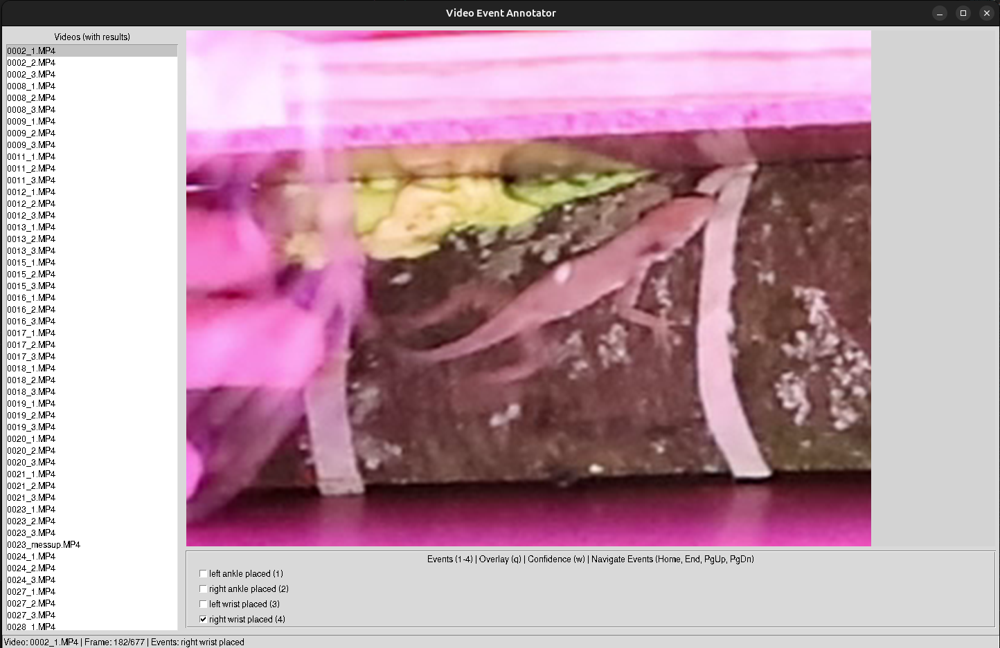

# Utils

This directory contains utility scripts for various tasks related to pose estimation and behavioral analysis. Some of these might be refactored into components of a pipeline in the future.

## results_extract_speeds.py

This script post-processes the results of the pose estimation. It calculates the velocity of each landmark in two ways:

1. By taking the difference between consecutive frames and then applying a low-pass filter.
2. By filtering the position data (using an exponential moving average with alpha=landmark confidence), then taking the difference between consecutive frames, and then applying a low-pass filter (butterworth filter with cutoff=15Hz).

The various resulting signals are then saved to HDF5 files for further analysis.

## videoeventannotatorapp.py

This script provides a GUI for annotating events (like foot/hand placement) in videos. It requires the object detection model `fine_tuned_detector.pth` to be present in the same directory (available in the group's dropbox).

## quick_label.py

This script provides a GUI for quickly annotating bounding boxes for object detection. It also provides the ability to retrain a detection model on the annotated data. It trains a Faster R-CNN model on the annotated data and saves the model to `fine_tuned_detector.pth`, which can then be used for inference in `videoeventannotatorapp.py` and some other apps.